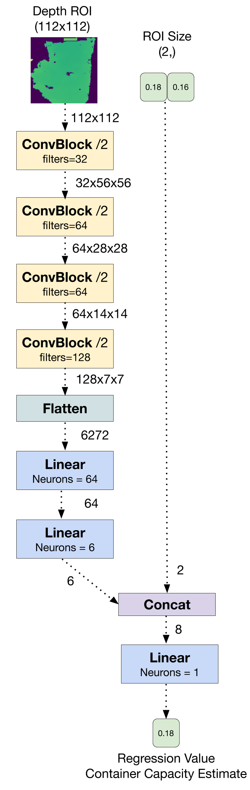

# CORSMAL Challenge 2020 - NTNU ERC Submission

This repository contains our (tentative) solutions code and presentation for the [CORSMAL Challenge 2020](http://corsmal.eecs.qmul.ac.uk/index.html) that ocurred during the [2020 Intelligent Sensing Sumer School](http://cis.eecs.qmul.ac.uk/school2020.html) organized by the Centre for Intelligent Sensing (CIS) of Queen Mary University of London.

The challenge consists in using multimodal, audio and visual data to perform three different tasks: filling level classification, filling type classification and container capacity estimation. The dataset can be found at [CORSMAL Containers Manipulation](http://corsmal.eecs.qmul.ac.uk/containers_manip.html) and contains RGB, Infrared and Depth images from 4 different PoVs, as well as Audio and IMU data.

Due to time constraints (we had about 4 days to complete the challenge) we only realized the tasks that we deemed easier(ish) and with limited modalities:

* **(1)** - Classification of filling type using Audio data.
* **(2)** - Estimation of container capacity using Depth data (from 1 PoV).

For (1), we compute and normalize the MFCCs sequence from audio data and use a simple 3-layer NN with Softmax outputs:

For (2), we first try to find a frame with a good ROI which contains the object in the Depth video, using contours candidates and filtering by distance.

Then, we feed the ROI along with its normalized dimensions (relative to original image dims) as inputs to a slightly larger network and perform regression:

More detailed information can be found in the PDF of our presentation in this repo.

### Instructions

The solution is split in two main files: `task1_run.py` and `task3_run.py`. Both scripts support command line arguments for specifying the dataset path as well as an input and output CSV filename. The scripts work by taking in an CSV and inserting the model's trained predictions in the correct column. By default, the input CSV is 'default.csv' which has all columns filled with -1.

To train a model and generate the predictions for the test set the scripts can be run like so:

	python taskX_run.py --dataset DATASET_PATH --input default.csv --output output.csv

We've also provided pre-trained models inside the `weights/` directory. To get predictions from the pre-trained models the script can be run like so:

	python taskX_run.py --pred --model-weights weights/taskX.weights

To get the final submission file with the provided weights you can run the following commands:

First, get predictions from task 1 using `default.csv` as base and output to `submission.csv`

    python task1_run.py --dataset DATASET_PATH --input default.csv --output submission.csv --pred --model-weights weights/task1.weights
    
Second, get predictions from task3 using `submission.csv` as base and output.
    
    python task3_run.py --dataset DATASET_PATH --input submission.csv --output submission.csv --pred --model-weights weights/task3.weights

The final predictions for tasks 1 and 3 should be in the `submission.csv` file. The column for task 2 should still be filled with -1.

### Requirements
    pip install torch torchvision librosa opencv-python matplotlib scikit-learn pandas natsort